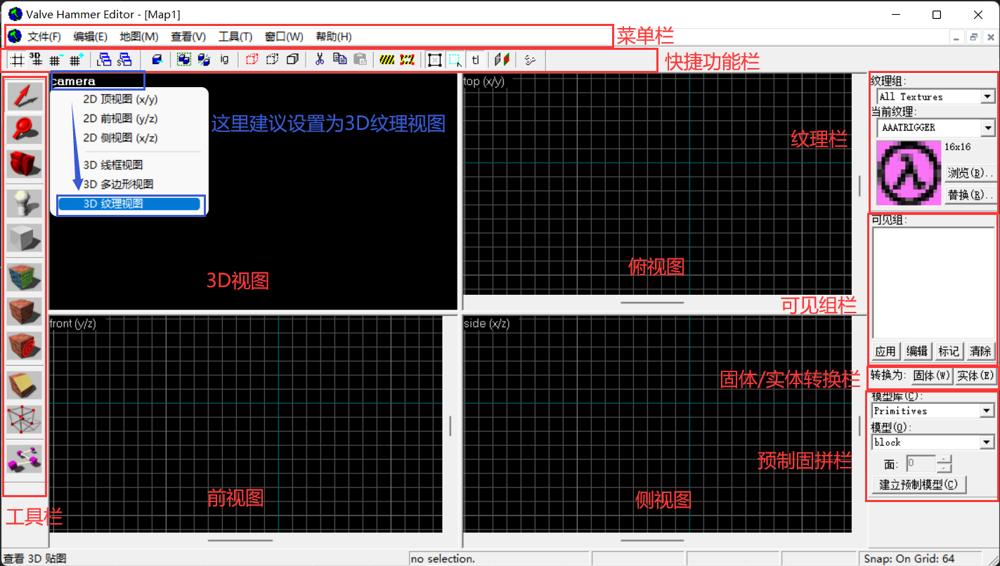
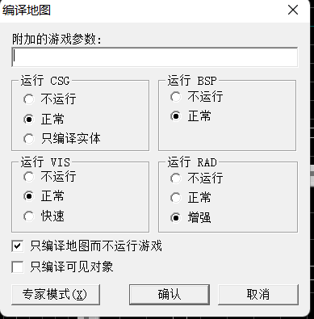

# 第一张地图

## 本节中你会了解
- hammer界面布局
- 如何制作一个简单的盒子地图，包括T、CT的出生点，灯光
- 编译地图：把地图源文件编译成bsp，在CS里游玩

# hammer界面布局
- 在菜单栏选择“文件”→“新建”来创建新地图
- 然后你会看到如下界面，每个板块的功能做了标注：
	- 
> 如图中3D视图右上角所示，建议设置3D视图为“3D纹理视图”模式，否则默认是“3D线框视图”，只能看到线，看不到面和纹理。设置方法：点击“camera”字样，然后点击“3D纹理视图”。

- 各部分暂不做详细介绍，如果想要详细了解，可以参考下面的链接：
	- *还没写完呢~暂时没有哦*

## 制作盒子
- 接下来我们要制作一个“盒子”，玩家可以在这个盒子范围里活动
- 在工具栏找到“固体工具”，点击一下会变成选中状态
- **创建固体**：在主视图左上角选一个位置，按住左键，向右下角拖拽（像是框选的感觉），然后按下```回车键```创建固体


- **3D视图移动视角**：按住```空格```，鼠标移到3D视图上，按住```鼠标左键```，此时可以按WASD来移动镜头了
	- 或者使用工具栏的“摄像机工具”，就无需按空格了
	- 将鼠标移动到3D视图上，然后按下```Z```键，鼠标光标将会锁定在3D视图内，此时即可进行地图场景漫游，而无需按住```空格```和 / 或```鼠标左键```，要想退出这一模式，再按一次```Z```键即可退出。


- **操控2D视图**：按住```空格```，然后按住鼠标拖拽来平移视图；滚轮可以放大、缩小视图。


- **选择物体**：在工具栏点击“选择工具“，框选来选择刚刚建好的固体，或者点击中心来选择，选中的物体在2D视图里固体变成红框，3D视图里也会变红。


?> 框选不能选择？默认设置下的选择可能需要按```回车键```确认，可以在设置里调整，勾选“选择对象不需要回车确定”；另外默认不需要点中心点也能选择物体，但是容易误选，所以一般勾上“仅点击中心点才能选择对象”。

- **编辑物体**：选择中后会进入编辑模式，可以编辑物体：
	- 一共有三种模式，单击物体来修改模式
		- 任意模式下都能拖拽物体来移动它
	- **修改尺寸模式**：默认模式，物体周围会出现8个点，拖拽能修改尺寸
	- **旋转模式**：物体角上出现4个点，拖拽来旋转（按住Shift来锁定旋转15度的倍数）
	- **斜切模式**：物体边中间出现4个点，拖拽来斜拉物体
	- 这里我们把原本很扁的固体拉高一些。


- **更换纹理**：点击右上角纹理栏的浏览，选择一个合适的纹理作为当前纹理。然后选择物体，点击左侧工具栏的“应用当前纹理”，可以把纹理应用到选择的物体上。


- **挖空固体**：现在这个固体还是实心的，hammer提供的功能可以挖空它，让它变成空心的。选中物体，然后点击 菜单栏→工具→挖空，默认值32即可（表示挖空后墙面厚度是32）。
  > 按下```Ctrl+H```也可以对固体进行挖空操作。


- 目前位置我们已经搭好游玩的场地了！接下来我们需要设置CT和T的出生点，并放一盏灯在地图里。

## CT、T出生点以及灯光
- 我们还需要给地图放上CT、T出生点，否则进地图后不能选择队伍（放几个出生点，队伍里就最多有几个人；超出的人是不能选队伍的，会提示队伍人数已满）
- **创建点实体**：设置出生点需要用到点实体工具，点击工具栏的“点实体工具”，在2D视图里调整位置，按下```回车键```来创建一个点实体。或者在3D视图里，点击要放置的位置来创建点实体。


- **修改实体类型为CT出生点**：在点实体上右键（只能在2D视图），选择属性，会弹出实体属性窗口。下拉菜单里选择```info_player_start```，它对应了CT出生点。


- **T出生点**：同样的方法，我们制作一个T出生点，T出生点对应的实体叫做```info_player_deathmatch```，把他们放在两侧，可以得到这样的结果。
	- 
- **制作灯**：没有灯的地图是漆黑一片的，我们放一个灯来照明。灯也是通过点实体来实现的，对应的名称叫做```light```，制作一个灯放在天花板上，调整颜色和亮度。
	- 如视频中放置了一个灯在天花板附近，颜色淡橘色，亮度为300。


- 现在我们的地图已经制作完成了！但是他还不能直接游玩，我们还需要把他编译为bsp，才能在CS里游玩。
## 编译地图
- **编译选项**：点击快捷工具栏最右侧的“编译地图”，会弹出设置按钮，几个设置分别如下：
	- 
	- CFG：统计地图实体和纹理信息，必须开启，否则不能生成bsp。
	- BSP：生成全亮（也就是无阴影）的bsp地图，必须开启，否则不能生成bsp。
	- VIS：生成可见性查询表，复杂地图可以提高FPS。
	- RAD：生成光影。
	- 一般来说，只打开CFG和BSP就可以得到能游玩的地图了，不过因为地图全亮，并不好看
	- CFG和BSP很快就能完成，而VIS和RAD都很慢，并且地图越复杂越慢
- **编译地图**：我们全部选正常即可（RAD选增强，效果会好些，但编译更慢），点击确认，然后等待四个步骤的编译完成。到之前设置的地方找生成的bsp文件，可以看到这里除了bsp以外还有很多编译的中间文件。
	- 
- **编译日志**：编译时hammer会弹出一个日志窗口，里面有编译过程的信息，如果编译出了错误，会在这里面显示。
	- 这个窗口里的内容也对应了生成的.log文件，它和.bsp放在同一个地方
	- 

- 能看到bsp文件说明编译完成了！如果看不到的话，大概率是上一节的配置出问题了，可以参考编译日志找找问题在哪儿。

## 享受你的第一张地图！
- **放置bsp**：编译好的bsp地图要放到CS的maps文件夹里（可能是cstrike的maps，也可能是cstrike_schinese的maps，看看自己的CS是哪一个）
- **游玩！**：打开游戏，应该能在列表里找到你的地图了，进去转转吧！


> 本节的地图源文件可以在这里下载
- 在下一节里，我们会添加更多东西来丰富地图。