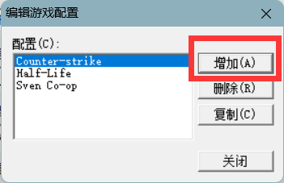
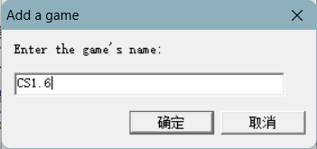
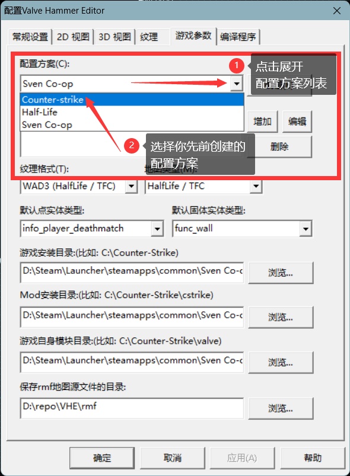
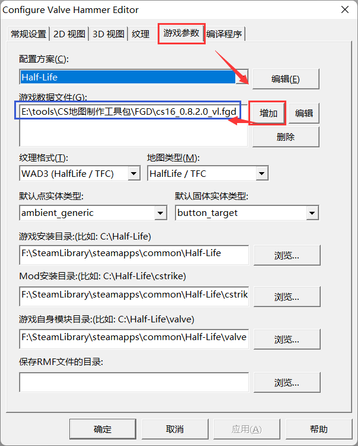

# 工具下载和配置

## 本节中你会了解
- 制作地图需要的基础工具：```Valve Hammer Editor 3.5``` （VHE、hammer）
- 准备工作：如何配置制图工具

## 制图工具
要制作地图，先要有趁手的工具。Valve Hammer Editor（简称VHE或hammer）是V社开发用于制作CS地图的软件，我们制作地图大部分内容都在这个软件里进行。VHE3.5是为CS1.6地图开发的最新版本（再往上的VHE4+是为CSS、CSGO制作地图的，互相不通用）。关于VHE的更多信息，[可以看这里](wiki/vhe)。
> J.A.C.K. （Jack hammer）是VHE的替代品，他是非官方开发的软件，主要功能和VHE相同，但是提供了很多方便的操作，详情可以看这里[J.A.C.K. :: Official Website (hlfx.ru)](https://jack.hlfx.ru/en/)，本文依旧针对VHE做讲解，但大部分内容是互通的。

首先在电脑上下载这个软件，这里提供了一个版本的VHE[【下载hammer工具包】](resources/CS地图制作工具包%202023.03.21.zip)，它除了基础的hammer3.5以外，还打包了其他可能用到的工具，包括：
- **hammer3.5**：最重要的制图工具，modchina同盟社版，X-man汉化
- **最新fgd**：V大 *cs16_0.8.2.0_vl.fgd*
- **最新编译程序**：V大 *vhlt v34*，64位
- **超级地图编译器**：第三方编译器，能方便地调整编译选项，发布前的最后一次编译一般用它，X-man开发
- **spr、mdl、bsp查看工具**：*HL Texture Tools*和*Sprite Explorer*、*HLMV*、*BSP Viewer*
- **地形制作工具**：方便地制作山体，导出map，*GenSurf*和*Terrain Generator*两款
- **纹理制作工具**：制作自己的wad纹理，*Wally*
- **纹理提取工具**：从bsp里提取打包的纹理，*wintextract*
- **反编译工具**：从bsp反编译得到map源文件，*winbspc*

下载解压后的目录结构是这样的：


其中“地图制作Hammer3.5.exe“就是主要的制图工具。

## 配置hammer
- 打开“地图制作Hammer3.5.exe“，你可以看到这样的界面
	- 
- 在正式开始做图之前，需要先配置hammer，一共要配置的有：
	- wad纹理：地图场景要用到的贴图纹理，**至少要添加一个**
	- fgd：全称是Forge Game Data，它包含了CS全部实体的信息，**必须配置，否则实体列表是空的**
	- 编译程序：hammer里制作的地图是地图源文件（rmf或map格式），需要编译程序生成bsp才能在CS里游玩

- 首先点击菜单栏的“工具"→”参数设置“，会弹出如下窗口
	- 
- **配置wad纹理**：选择“纹理”选项卡，点击“添加”来添加纹理
	- 一般会选择halflife.wad（在CS主目录的valve文件夹里，它包含了半条命1使用的很多纹理）和zhlt.wad（在工具包的tools文件夹里，包含了一些特殊纹理）
	- 
- **配置方案**：切换到游戏参数选项卡
	- 找到“配置方案”选项卡，点击“编辑”，请注意**不要点到**下方打叉的“编辑”按钮。
	- 
	- 在弹出的窗口中点击增加按钮。
	- 
	- 为你的配置方案起个名字。
	- 
	- 你可以给他起一个好区分的名字，例如你想做CS1.6的地图，你可以为这一个配置方案起名CS1.6；又比如你想做半条命的地图，你可以为这一个配置方案起名Half-Life。总之，取什么名字，仅取决于你自己的个人喜好。
	- 完成创建后点击“确定”保存这一方案，回到设置中，选择你先前创建的配置方案。
	- 
	- 这样一来，你接下来所做的配置步骤，将会保存在当前选定的配置方案中。由于在后续配置中我们还要继续使用到配置方案，请务必记住你当前选定的配置方案名字是什么。
	> 对于大多数只想制作CS1.6地图的玩家来说，配置方案并没有什么意义，但当你需要为多个金源引擎的游戏制作地图的时候，由于每个游戏采用不同的“游戏参数”和“编译程序”设定，如果使用单一配置方案，每次都得重新设定所有选项，费时费力，而使用多个配置方案则可以大幅降低工具配置的工作量，你可以通过切换配置方案，快速更改Valve Hammer Editor的“游戏参数”和“编译程序”设定，而无需手动重新配置，为你的地图制作工作节约许多时间，这就是配置方案的意义所在。
- **配置fgd**：切换到“游戏参数”选项卡，点击“添加”，只需添加V大最新的FGD（工具包的fgd文件夹中已经有了）
	- 
- **配置编译程序**：切换到“编译程序”选项卡
	- 选定配置方案。你先前在“游戏参数”中配置时，选定的配置方案是什么，这里的配置方案也就选什么，这就是为什么先前需要你记住创建的配置方案名字。
	- 
	- 设置CSG、BSP、VIS、RAD程序（都在工具包的tools文件夹里，名称分别是hlcsg_x64.exe、hlbsp_x64.exe、hlvis_x64.exe、hlrad_x64.exe）
	- “存放编译好地图的目录”可以填CS的maps文件夹，这样bsp直接放到maps里，不需要手动复制过去
	- “游戏执行程序”就是cstrike.exe的路径，如果勾了编译后自动启动游戏，就会用指定的这个CS程序，也可以不设置
	- 
- 点击下方的“确定”，完成设置
- 到此为止，所有的准备工作已经做完了！下一节里，我们会开始制作第一张地图！
> 一些编译程序并不接受包含中文字符的路径，这可能会导致一张正常的地图无法通过编译。通常的解决方案分两种，第一种方法是将所有包含中文字符的文件夹都改为全英文，但这一做法通常还需要你把配置中的中文路径也一并修改，比较麻烦；另一种方法是使用支持中文字符的编译程序，其中，本教程所提供的编译程序支持中文字符路径，因此，你可以放心使用。