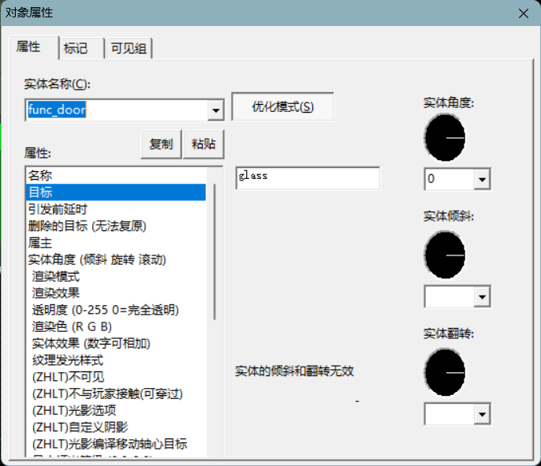
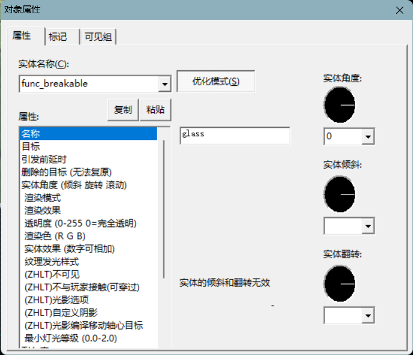

# 实体复位
如果一个实体无法在每局开始自动触发，而你需要让他每局开始都会自动触发，你该怎么做？
## 使用func_door实体
我们在[func_door](func_door.md)和[func_door_rotating](func_door_rotating.md)里面曾提到过，门在新一局开始的时候会自动复位，同时会触发一次目标，我们可以运用这一个特性去实现。
 为了方便说明，此处我们希望实现的效果是每局开始时，某一个特定的物品将会碎裂。
- 创建一个固体，将其放在玩家无法接触到的地方，并转化为固体实体func_door，目标栏填写需要触发的func_breakable名称，如果还没新建有这个func_breakable实体的话，你可以先写上一个你将要给func_breakable实体采用的名字，此处我以glass为例。

- 新建一个func_breakable实体，并命名为先前在func_door的“目标”键值中填写的名字，先前我们填写的是glass，那么这里我们也就写glass

- 这样一来，每局开始都会触发这一实体，打开游戏看一看效果如何。

## 特殊实体名称
在上一个方法中，毫无疑问的是玻璃会在每一局开始时破碎，但是在游戏首局启动的时候，玻璃是完好无损的。其次是，当我们希望让玩家获得特定武器装备的时候，func_door似乎不再有效，因为它会让游戏闪退，原因非常明显，触发[game_player_equip](game_player_equip.md)的是func_door实体，而func_door显然是不能拥有武器的，它一拥有武器，就会导致游戏出错并且闪退。
 因此我们引入一个新的方法，去解决这些问题。
### **game_playerspawn**
实体名称命名为game_playerspawn，将会使得该实体在玩家出生后触发，因此，给一个game_player_equip实体命名为game_playerspawn，将会让玩家在出生后立即就触发该实体，并且能够正常获得武器，同时，即使是在刚开始游戏的第一局，该实体也能够正常触发，这是不同于func_door的一点。
### **game_playerleave**
实体名称命名为game_playerleave，将会使得该实体在玩家离开后触发，因此，给一个game_text实体命名为game_playerleave，将会在玩家离开时触发game_text实体，并显示game_text里的内容。
### **game_playerjoin**
与game_playerleave相似，但是触发条件是玩家加入时触发，触发者为加入者。
### **game_playerdie**
与game_playerleave相似，但是触发条件是玩家死亡时触发，触发者为死亡者。
### **game_playerkill**
与game_playerleave相似，但是触发条件是玩家击杀时触发，触发者为击杀者，可以用来实现杀人加血的功能，你只需要为[game_player_hurt](game_player_hurt.md)实体命名为game_playerkill，即可让玩家在击杀敌人后，获得血量加成。